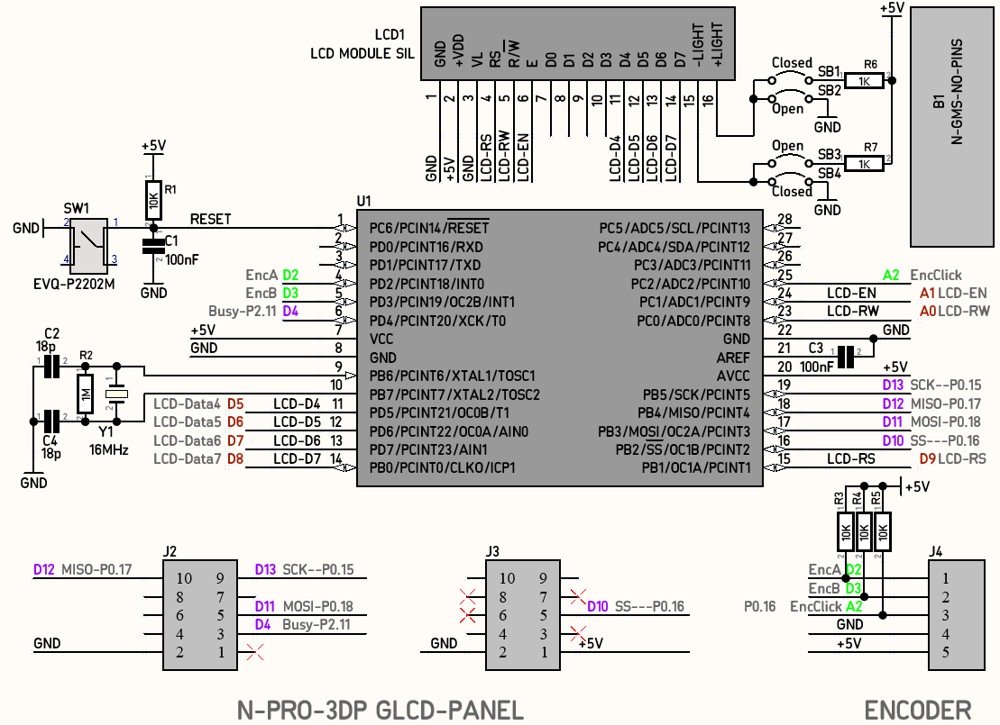
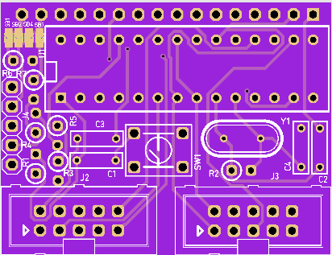
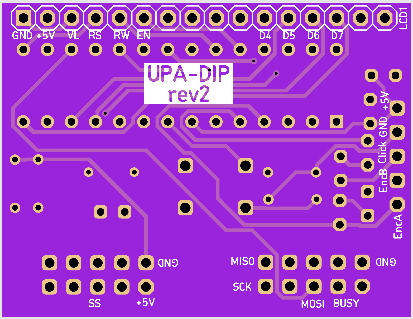
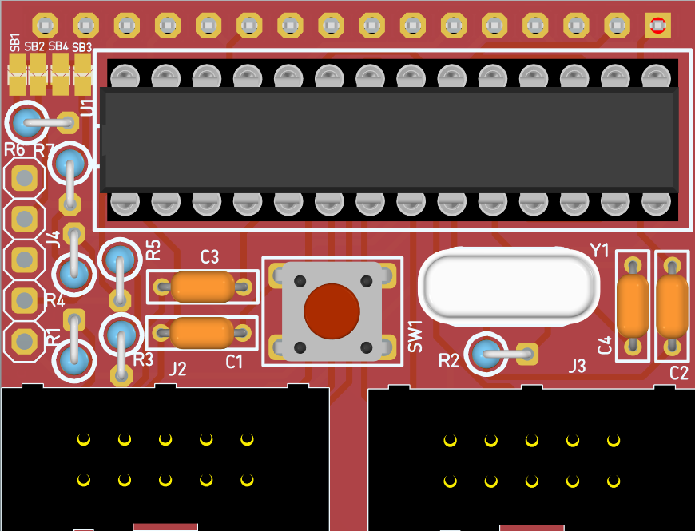
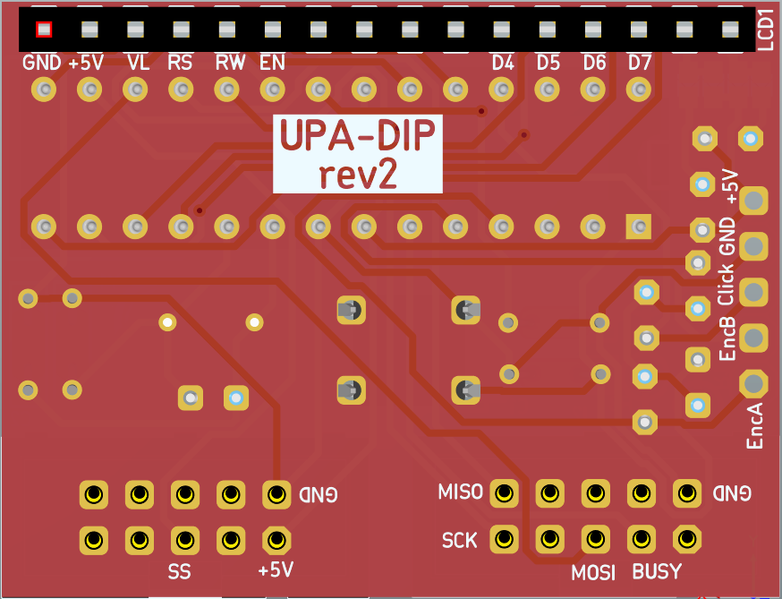
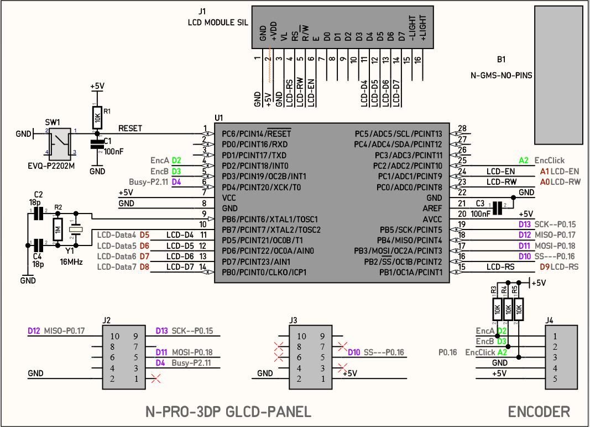
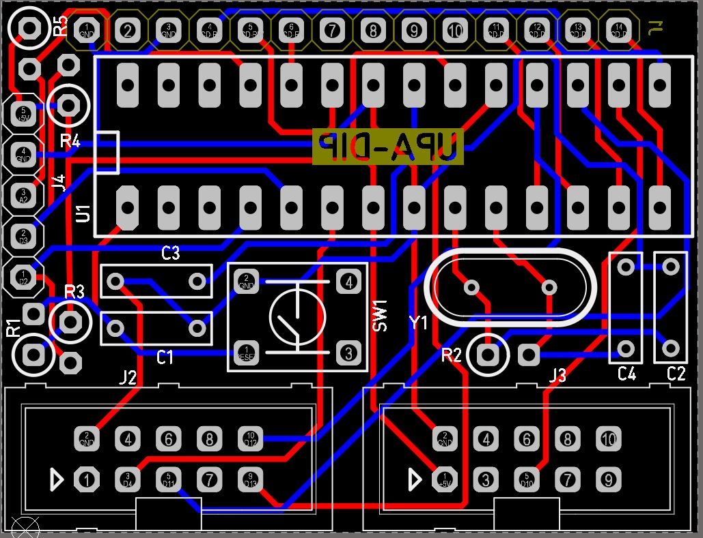

# [UPA-DIP](https://github.com/Motion-Controller/UPA-DIP)

####  UPA-DIP Board: SPI to PARALLEL 20x4 LCD with GLCD Reprap PANEL Interface
####  Part of the project: [prj_UPA_minimal](https://github.com/nikoschalikias/prj_UPA_minimal)
---

**Block Diagram**

---
## Revision V2
**Schematic**

 &nbsp;&nbsp;

---

**43mm x 33mm n-Blocks form factor PCB**

 &nbsp;&nbsp;  &nbsp;&nbsp;  &nbsp;&nbsp; 

## ***********************  Revision V1 *****************************

**Schematic**

 &nbsp;&nbsp;

---

**43mm x 33mm n-Blocks form factor PCB**

 &nbsp;&nbsp;  &nbsp;&nbsp;  &nbsp;&nbsp; 

---

## JLCPCB

PCB is ordered

 
